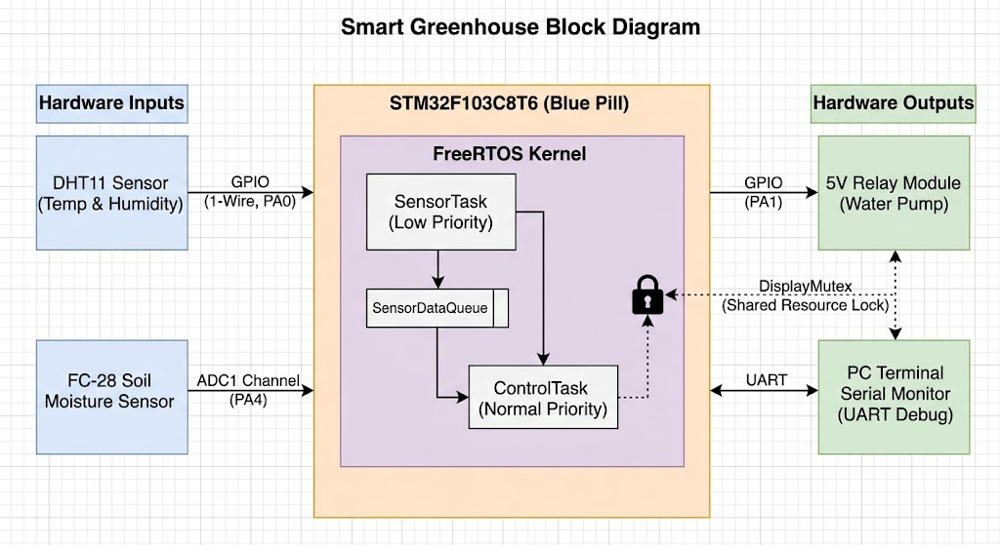

# RTOS_smart_greenhouse
In traditional farming, manual monitoring of environmental factors like soil moisture and temperature is inefficient and prone to human error. A Smart Greenhouse requires a system that can simultaneously monitor multiple sensors, control irrigation logic in real-time, and ensure system safety (e.g., preventing water overflow). An RTOS is necessary here to manage these concurrent tasks, ensuring that a slow sensor-reading task does not delay a critical water-cutoff command.


## RTOS Architecture & Core Concepts

To meet strict real-time deterministic requirements, this system discards traditional sequential execution patterns in favor of a preemptive priority-based multi-tasking framework utilizing **FreeRTOS**:

1. **Task Management & Priority Scheduling (`osPriority`)**:
   * `SensorTask` (**Low Priority**): Periodically wakes up every 2000ms using non-blocking `osDelay()` to sample telemetry. Environmental factors change slowly, preventing the need to hog CPU cycles.
   * `ControlTask` (**Normal Priority**): Remains blocked until data arrives. It has a higher priority so that the FreeRTOS kernel immediately context-switches to execute irrigation commands the microsecond data is ready.
2. **Inter-Task Communication (`Queues`)**:
   * Thread-safe memory isolation is handled via `SensorDataQueue`. Environmental variables are marshaled into a custom structural datatype (`GreenhouseData_t`) and pushed by the sensor producer to the queue. This prevents race conditions.
3. **Resource Synchronization (`Mutexes`)**:
   * The physical I2C peripheral (OLED screen) and USART1 serial line are non-reentrant shared assets. We implement a mutual exclusion lock (`DisplayMutex`). Threads must successfully block and acquire the mutex token using `osMutexAcquire()` before printing to avoid data corruption or screen glitches.
   ## Hardware Configuration & Pinout Mapping

The physical wiring schematic is mapped directly to the **STM32F103C8T6 (Blue Pill)** as follows:

| Component | Pin Name | STM32 Peripheral Connection | Protocol / Signal Type | Supply Voltage |
| :--- | :--- | :--- | :--- | :--- |
| **DHT11 Climate Sensor** | DATA | **PA0** | GPIO Digital Input (1-Wire) | 3.3V |
| **FC-28 Soil Moisture** | AO (Analog Out) | **PA4** | ADC1_IN4 (Analog Input) | 3.3V |
| **5V Relay Module** | IN (Trigger Input)| **PA1** | GPIO Digital Output | 5.0V |
| **SSD1306 OLED Screen** | SCL<br>SDA | **PB6**<br>**PB7** | I2C1_SCL Clock<br>I2C1_SDA Data | 3.3V |
| **FTDI Debugger Module**| RX<br>TX | **PA9 (TX)**<br>**PA10 (RX)** | USART1 Serial Transmit<br>USART1 Serial Receive | 3.3V Logic |
## Testing & Expected Output Logs

When tracking system execution through a serial monitor terminal (e.g., PuTTY or Tera Term) at a **115200 Baud Rate**, the deterministic context switching behaves as follows:

```text
[RTOS Kernel] Initializing Scheduler Engines... Success.
[RTOS Kernel] Tasks launched. System running deterministically.

[Sensor Task] Data sampled. Temperature: 24.5C | Humidity: 60%
[Sensor Task] Sending struct to SensorDataQueue...
[Control Task] Queue element parsed. Soil Moisture level: 412 (Saturated)
[Control Task] Pump status: OFF

[Sensor Task] Data sampled. Temperature: 24.6C | Humidity: 59%
[Sensor Task] Sending struct to SensorDataQueue...
[Control Task] Queue element parsed. Soil Moisture level: 185 (Dry Soil Alert)
[Control Task] Target threshold violated! Triggering Actuator...
[Control Task] Pump status: ON
